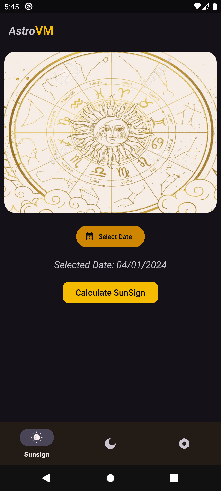
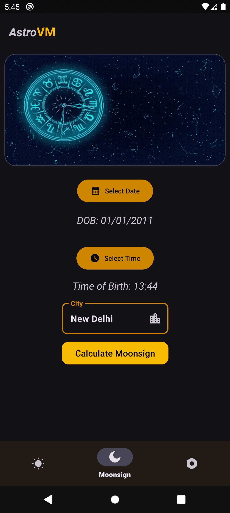
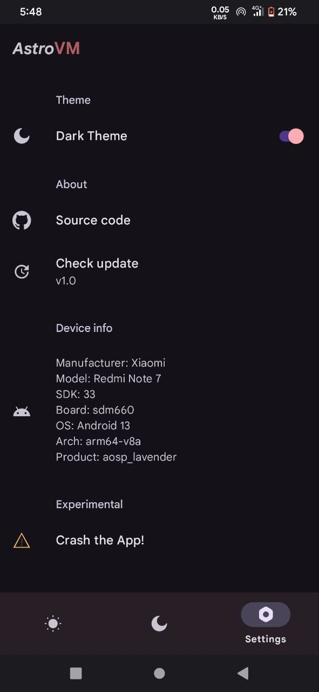
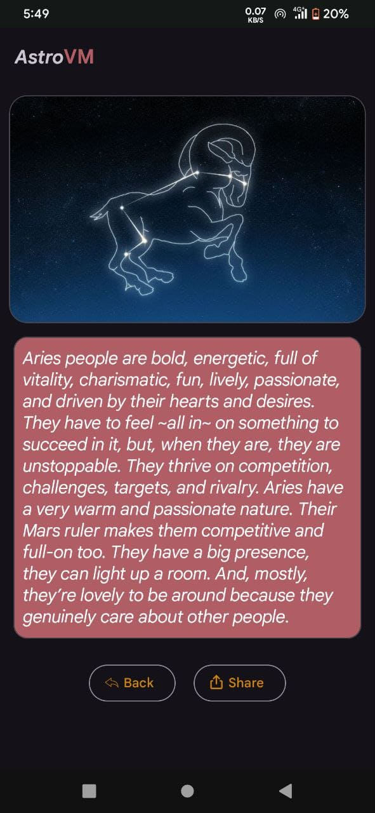

# About AstroVM

AstroVM is a slick Zodiac sign calculator for Android, designed to provide users with accurate Sun and Moon sign information based on their date of birth and birthplace details. The app utilizes modern Android development practices, including View Bindings, Material Design, Couroutines, Viewmodel, OkHttp, and a sleek dark / light theme for an enhanced user experience.

## Features

- **Sun Sign Calculation:** Input your date of birth, and the app calculates and displays your Sun sign.
- **Moon Sign Calculation:** Enter your date of birth, place of birth, time of birth, and city details. The app calculates your Moon sign by determining the moon's position in the constellation at the time of birth.
- **Shareable Results:** Easily share your Sun and Moon sign information with friends and family.

## Screenshots

<div style="display:flex; justify-content:space-between;">
  
  
  
</div>

<div style="display:flex; justify-content:space-between;">
  
  
</div>

### API's used:

#1) Api Ninja's [TimezoneAPI](https://api-ninjas.com/api/timezone) : To calculate Timezone of user's City.

#2) Ved Astro's [RashiAPI](https://github.com/VedAstro/VedAstro) : To calculate position of moon, do star ⭐ this awesome repository.

## Getting Started

To use AstroVM, grab the latest asset from releases & to fork, follow these steps:

1. Clone the repository: `git clone https://github.com/IndusAryan/AstroVM.git`
2. Open the project in Android Studio.
3. Build and run the app on an emulator or physical device.

## Dependencies

The app uses the following key dependencies:
```kotlin
/* Tests */  
testImplementation("junit:junit:4.13.2")  
androidTestImplementation("androidx.test.ext:junit:1.1.5")  
androidTestImplementation("androidx.test.espresso:espresso-core:3.5.1")  
  
/* Android Core & Lifecycle */  
implementation("androidx.core:core-ktx:1.12.0")  
implementation("androidx.appcompat:appcompat:1.6.1")  
implementation("androidx.lifecycle:lifecycle-livedata-ktx:2.7.0")  
implementation("androidx.lifecycle:lifecycle-viewmodel-ktx:2.7.0")  
  
/* UI */  
implementation("androidx.legacy:legacy-support-v4:1.0.0")  
implementation("androidx.preference:preference-ktx:1.2.1")  
implementation("com.google.android.material:material:1.11.0")  
implementation("androidx.navigation:navigation-ui-ktx:2.7.6")  
implementation("androidx.constraintlayout:constraintlayout:2.1.4")  
implementation("androidx.navigation:navigation-fragment-ktx:2.7.6")  
  
/* Networking */  
implementation("com.google.code.gson:gson:2.10.1")  
implementation("com.squareup.okhttp3:okhttp:4.12.0")
```

## Contributing
If you would like to contribute to the project in any way better, you can PR.

## License
[](http://www.gnu.org/licenses/gpl-3.0.en.html)

This app is fully FOSS. You can use, study, share and modify it at your will. It can be redistributed and/or modified under the terms of the [GNU General Public License](https://www.gnu.org/licenses/gpl.html) version 3 or later published by the Free Software Foundation.

---

